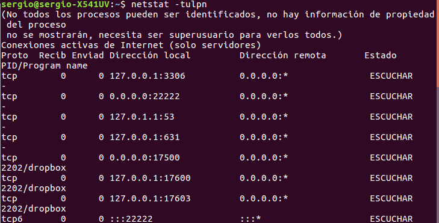

## Ejercicio T6.1 ##
Aplicar con iptables una política de denegar todo el tráfico
en una de las máquinas de prácticas.
Comprobar el funcionamiento.
iptables -A INPUT-j DROP
Aplicar con iptables una política de permitir todo el tráfico
en una de las máquinas de prácticas.
Comprobar el funcionamiento.
iptables -A INPUT -j ACCEPT 
Teniendo en cuenta que cada vez que hagamos un cambio debemos eliminar la tabla creada con la orden: iptables -D INPUT -j DROP

 
## Ejercicio T6.2 ##
Comprobar qué puertos tienen abiertos nuestras máquinas,
su estado, y qué programa o demonio lo ocupa. 
netstat -tulpn

## Ejercicio T6.3 ##
Buscar información acerca de los tipos de ataques más
comunes en servidores web (p.ej. secuestros de sesión).
Detallar en qué consisten, y cómo se pueden evitar. 
-Los **ataques de inyección**, más específicamente sqli (Structured Query Language Injection) es una técnica para modificar una cadena de consulta de base de datos mediante la inyección de código en la consulta. El SQLI explota una posible vulnerabilidad donde las consultas se pueden ejecutar con los datos validados.

-La **Denegación de Servicio (DoS) ó Denegación de Servicio Distribuida (DDoS)** son las formas más comunes para congelar el funcionamiento de un sitio web. Estos son los intentos de inundar un sitio con solicitudes externas, por lo que ese sitio no podría estar disponible para los usuarios reales. Los ataques de denegación de servicio por lo general se dirigen a puertos específicos, rangos de IP o redes completas, pero se pueden dirigir a cualquier dispositivo o servicio conectado.

-Los **ataques de fuerza bruta** buscan contraseñas débiles para ser descifradas y tener acceso de forma facil. Los atacantes cuentan con buen tiempo, así que el truco es hacer que tus contraseñas sean lo bastante seguras y así el atacante se cansaría antes de descifrar tu contraseña.
-Los atacantes utilizan **Cross-site Scripting (XSS)** para inyectar scripts maliciosos en lo que serían sitios web inofensivos. Debido a que estos scripts parecen provenir de sitios web de confianza, el navegador de los usuarios finales casi siempre ejecuta la secuencia de comandos, la concesión de los piratas informáticos el acceso a la información contenida en las cookies o tokens de sesión utilizados con ese sitio. El XSS generalmente se utiliza para obtener acceso de un usuario de la cuenta.
